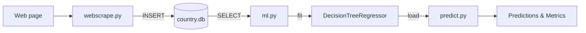

# Country Area Prediction

A lightweight end-to-end machine learning project that scrapes real country data (population & area) from the web, stores it locally in SQLite, and trains a **Decision Tree regressor** to predict a country's area from its population.

Built as a portfolio piece demonstrating web scraping, data pipelining, and scikit-learn regression.

## Features

- Scrapes real country data with `requests` + `BeautifulSoup`.
- Stores data locally with **SQLite** (no database server required).
- Trains a `DecisionTreeRegressor` (population → area).
- Interactive CLI to test the model with new inputs.
- One-command pipeline: **scrape → train → test**.

## Tech Stack

| Layer        | Technology                                     |
|--------------|------------------------------------------------|
| Language     | Python 3.13                                    |
| ML           | scikit-learn, numpy                            |
| Scraping     | requests, BeautifulSoup (bs4)                  |
| Storage      | sqlite3 (standard library)                     |

## ML Pipeline



## Project Structure

```
├── main.py        # Orchestrates the full pipeline (scrape → train → test)
├── webscrape.py   # Scrapes country data into SQLite
├── ml.py          # Loads data and trains the model
├── predict.py     # Interactive CLI: metrics + predictions
├── import sys.py  # Utility: LCA (Lowest Common Ancestor) class
├── requirements.txt
├── .gitignore
└── README.md
```

## Dataset

Scraped from `https://www.scrapethissite.com/pages/simple/` into the `countries` table of the local `country.db` database (generated at runtime, not committed to the repo).

| Field        | Type     | Description                     |
|--------------|----------|---------------------------------|
| `country`    | TEXT     | Country name                    |
| `population` | INTEGER  | Population of the country       |
| `area`       | REAL     | Area in km²                     |

> Rows accumulate on each scrape run (there is no de-duplication).

## Input, Target, Model & Metrics

- **Input feature:** `population`
- **Target:** `area`
- **Model:** `DecisionTreeRegressor` (scikit-learn)
- **Metrics:** R² (5-fold cross-validation) and Mean Absolute Error

## Installation & Setup

```bash
python -m venv .venv
.venv\Scripts\activate          # Windows
# source .venv/bin/activate     # macOS / Linux

pip install -r requirements.txt
```

## Usage

Run the full pipeline (scrape → train → interactive test):

```bash
python main.py
```

Or run each step manually:

```bash
python webscrape.py   # 1. Scrape data into country.db
python ml.py          # 2. Train the model
python predict.py     # 3. Test / evaluate interactively
```

### Interactive example

```
Model score (population -> area):  R² = 0.838   MAE = 83,999
Type a number and press Enter. Enter 'q' to quit.
population -> 84000000
area = 357,021.0
```

Enter a population to get a predicted area; type `q`, `quit`, or `exit` to leave.

## Results & Limitations

- **R² (5-fold CV):** `0.838` — the model explains ~84% of variance in area.
- **MAE:** `83,999 km²` — **reported on the training data (in-sample)**, not cross-validated.

Limitations:

- Uses only **one feature** (`population`), limiting predictive power.
- **MAE is in-sample**, so it may be optimistic compared to unseen data.
- A reverse model (`area2pop`) is trained in `predict.py` but is **not exposed** in the interactive CLI.

## Configuration

No configuration or environment variables are required. The `country.db` SQLite file is created automatically on first run. No credentials or secrets are used.

## Future Improvements

- De-duplicate data (avoid accumulating rows on repeated scraping).
- Add more features (e.g., region, density) to improve predictions.
- Expose the trained reverse model (`area → population`) in the CLI.
- Persist and reload the trained model (e.g., `joblib`) instead of retraining each run.
- Convert metrics to proper train/test split reporting.

